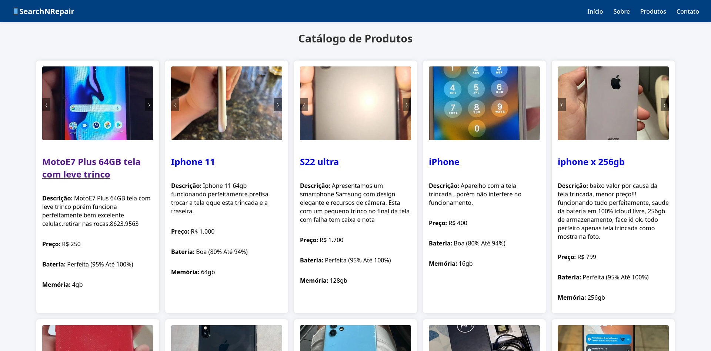

# Search'n Repair 📱🔍

🔗 **Acesse agora:** [https://searchnrepair.netlify.app/](https://searchnrepair.netlify.app/)  
⚠️ Importante: Após acessar o site pela primeira vez, pode demorar até 2 minutos para os dados carregarem, pois a API está hospedada no plano gratuito da Render, que mantém o serviço em hibernação. Após esse tempo, atualize a página para visualizar os celulares com defeito.

---

## 🖼️ Preview

  

---

## 💡 Sobre o projeto

Search'n Repair é uma aplicação web que busca e exibe **celulares com defeito** listados na OLX.  
Combinando automação, inteligência artificial e uma interface intuitiva, o sistema identifica aparelhos com trincos e outros problemas, facilitando a pesquisa para quem busca por reparo, revenda ou peças.

---

## ⚙️ Como funciona

1. **Extração de dados (Web Scraping com Selenium - Python)**  
   Um robô automatizado coleta dados de celulares diretamente da OLX.

2. **Análise com Inteligência Artificial (Gemini 2.0 - GCP)**  
   A IA analisa título e descrição dos anúncios para identificar indícios de defeitos.

3. **API REST com Spring Boot**  
   Uma API organiza e distribui os dados extraídos para o frontend.

4. **Frontend web responsivo (HTML, CSS, JS)**  
   Interface limpa e funcional onde os celulares com defeito são exibidos ao usuário.

5. **Deploy completo**  
   - API e banco de dados PostgreSQL hospedados na [Render](https://render.com)  
   - Interface hospedada na [Netlify](https://netlify.com)

---

## 🧪 Tecnologias utilizadas

- **Back-end:** Spring Boot (Java)
- **Banco de dados:** PostgreSQL
- **Web Scraping e IA:** Python (Selenium) + Gemini 2.0 (Google Cloud)
- **Front-end:** HTML, CSS, JavaScript
- **Hospedagem:** Render (API e banco) e Netlify (frontend)
- **Versionamento:** Git

---

## 🔮 Possíveis melhorias

- Filtro por marcas, modelos e faixas de preço
- Estatísticas e gráficos com dados dos aparelhos
- Sistema de autenticação para usuários salvarem favoritos

---

## 📫 Contribuições

Sugestões, melhorias e correções são bem-vindas!  
Sinta-se à vontade para abrir uma *issue* ou *pull request*.
# SearchNRepair
